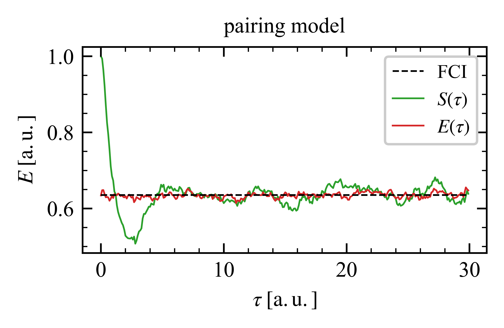

# pyFCIQMC

This is a FCIQMC algorithm for pairing model (written in python).

FCIQMC is (one of) the most accurate _ab initio_ man-body method in quantum chemistry and many other areas. However, in nuclear physics, this method is not explored yet.

This accurate method have the full potential to become the most accurate _ab initio_ man-body method in nuclear physics.

# Requirements

The program are runned with python3.8+ and the following packages:

- numpy>=2.3.0
- scipy>=1.15.3
- matplotlib>=3.10.3
- pandas>=2.3.0

# Examples

- run the FCIQMC calculations following:

```python
cd /your/path/pairFCIQMC
python3 examples/example_fciqmc.py
```

and you can get the FCIQMC evolution results plotted in the end:



where $E(\tau)$ is usually used for final estimation of ground state energy.

- we also provide FCI, MBPT(2,3,4), CCD, IMSRG(2) methods in the code, see other scripts in example dir.

# Citation

If you use this code in your research, please cite this github page and our papers.

# Acknowledgement

If you have any futher needs or questions, please contact rongzhe_hu@pku.edu.cn.
