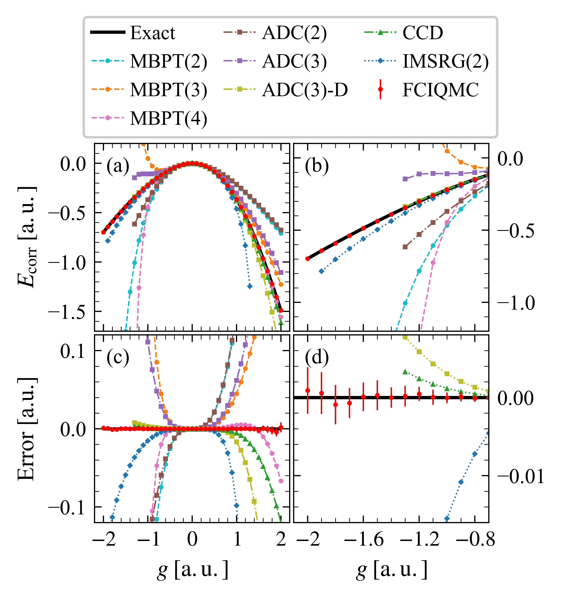

# pairFCIQMC

This is a FCIQMC algorithm for pairing model (written in python).

FCIQMC is (one of) the most accurate _ab initio_ man-body method in quantum chemistry and many other areas.

This method have the full potential to become the most accurate _ab initio_ man-body method in nuclear physics, which is the main purpose of our present work.

# Data

The data used in the paper is collected in "data" dir:

- data_pairing.txt: Richardson pairing model results
- data_comparison.txt: Nuclear matter benchmarking results
- data_eos_emn.txt: Eos of PNM and SNM using N2LO-EMN interaction
- data_eos_go.txt: Eos of PNM and SNM using N2LO-Delta-go interaction

# Requirements

The python program for the pairing model are runned with python3.8+ and the following packages:

- numpy>=2.3.0
- scipy>=1.15.3
- matplotlib>=3.10.3

where scipy and matplotlib are not necessary in principle.

# Examples

- run the FCIQMC calculations following:

```python
cd /your/path/pairFCIQMC
python3 examples/example_fciqmc.py
```

and you can get the FCIQMC evolution results plotted in the end:


where $E(\tau)$ is usually used for final estimation of ground state energy.

- we also provide FCI, MBPT(2,3,4), CCD, IMSRG(2) methods in the code, see other scripts in example dir.

- a final detailed comparison of FCIQMC with other truncated many-body methods is shown as:

  

  , among which FCIQMC is the most accurate obviously.

# Citation

If you use this code in your research, please cite this github page and our papers.

# Acknowledgement

If you have any futher needs or questions, please contact rongzhe_hu@pku.edu.cn.
